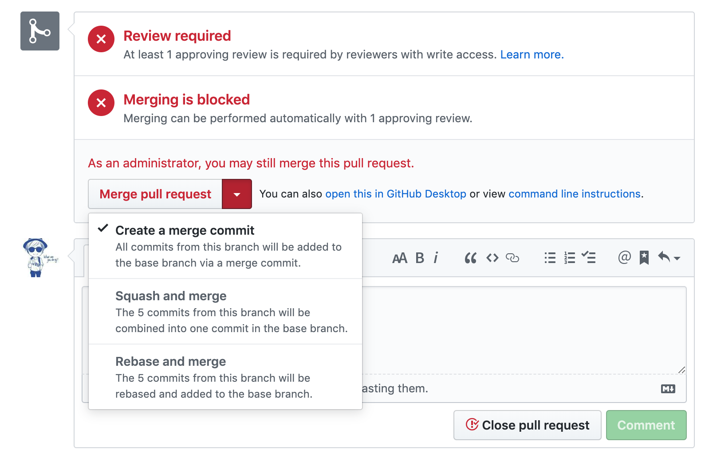

# 开源项目Lin CMS的开发流程

## 前言

[林间有风](https://github.com/TaleLin)团队目前共有两个开源项目，一个是微信小程序原生组件库 Lin UI，一个是前后端分离的web端内容管理系统 Lin CMS。笔者属于 Lin CMS 前端小组，也就是 lin-cms-vue 项目。从 `2019年1月17日` 提交第一个 commit 至今差不多已经半年时间，在磕磕绊绊中也有了些许成长。

本文主要介绍 lin-cms-vue 的开发流程。刚开始团队成员较少，都是在一个分支上进行开发，并没有过多的考虑什么流程方案。后来由于团队成员的不断补充，我们开始规范开发流程，采用的是目前比较主流的 GitFlow 工作流。一个好的、统一的开发流程，在团队合作中是至关重要的，能够极大的提升工作效率。那么下面大致介绍下 GitFlow 工作流。

## GitFlow工作流

虽然有这么优秀的版本管理工具（Git），但是我们面对版本管理的时候，依然有非常大的挑战，大家工作在同一个仓库上，那么彼此的代码协作必然带来很多问题和挑战，如下：

- 如何开始一个 Feature 的开发，而不影响别的 Feature？
- 由于很容易创建新分支，分支多了如何管理，时间久了，如何知道每个分支是干什么的？哪些分支已经合并回了主干？

GitFlow 被誉为是在 Git 之上构建的一项软件开发最佳实践，**它定义了一个围绕项目发布的严格分支模型**。GitFlow 没有增加任何新的概念和命令，它只是一个 git 管理的规范，一个开发的指导方针。


| 分支        | 说明           |
| ---------- | ---------|
| master     | 主分支(保护分支)      |
| develop    | 开发分支(保护分支)      |
| hotfix/    | bug紧急修复分支     |
| feature/   | 功能分支，开发新功能，完成以后合并到开发分支 |


通过上面的简单介绍我们大致了解了什么是 GitFlow 工作流，当然这只是一个指导方针，在实际应用中还要根据项目及成员的具体情况来进行适当的调整。

我们将 `master` 和 `develop` 分支列为保护分支。保护分支意味着任何人不得直接提交代码到该分支，只能通过 `Pull Request` 合并分支。下面以一个新功能的开发为例，介绍下相关开发流程。


## 开发流程

这里以开发一个新的功能验证码（security code）为例：

### 开发新Feature

从当前最新的开分分支 `develop` 切出一个 `feature` 功能分支，执行下面命令，注意这是在本地仓库的新分支：

```sh
git checkout -b security-code
```

在 `security-code` 分支编写功能代码，提交commit，到此时我们均是在本地仓库操作，如果想要将本地的 security-code 分支 push 到远端，执行下面命令，其中 feature/ 代表这是一个功能分支：

```sh
git push origin security-code:feature/security-code

 * [new branch]      security-code -> feature/security-code
```

在远端创建了 feature/security-code 分支后，security-code 的功能还没有开放完毕，需要继续开发并提交 commit。将近期 commit 提交至远端，执行以下命令：

```sh
git push origin HEAD:feature/security-code
```

如果在开发 `security-code` 时，有小伙伴将新功能合入了 `develop` 而 security-code 又依赖新功能怎么办？那就把远端已经合并过最新的开发分支 develop 拉下来：

```sh
git pull origin develop
```

假设 `security-code` 已经开发完毕，并且有10条commit记录，我们要将功能分支的代码合并到开发分支：提交 `PR` 到 `develop` 分支。 不管是团队成员还是外部贡献者的 pull request 都需要经过代码 `review` 才能合并进开发分支。代码合并有三种方式：**Create a merge commit / Squash and merge / Rebase and merge**。



第一种 (Create a merge commit) 直接将 `security-code` 分支的 commit 合并到 `develop`。

第二种 (Squash and merge) 将 `security-code` 分支的这10条 commit 合并成一条后，再合入 `develop`（建议使用）。

第三种 (Rebase and merge) 与第二种功能一样，区别是 rebase 变基，squash 只合并 commit。

合并分支后即可将功能分支删除，删除分支分为删除本地分支和远端分支，远端分支的删除直接在 GitHub 页面操作即可，下面的命令来删除本地分支：

```sh
git branch -D security-code
```

经过长时间的分支增删后，我们会发现有些远端的分支分明已经删掉了，但是在本地分支通过 `git branch -a` 还是能够看到那些已经被删除掉的分支，这时候我们可以用下面的命令进行清理：

```sh
git remote prune origin

➜  lin-cms-vue git:(exception) git remote prune origin
修剪 origin
URL：https://github.com/TaleLin/lin-cms-vue.git
 * [已删除] origin/components/select
 * [已删除] origin/feature/404
 * [已删除] origin/feature/enter-animation
 * [已删除] origin/feature/layout
 * [已删除] origin/feature/ui-color
 * [已删除] origin/feature/ui-op
 * [已删除] origin/publish/beta2
```

### 版本发布

经过一段时间的开发，我们完成了一个阶段的开发任务。这时候要进行功能测试，将当前开发分支的代码部署到测试环境，团队成员共同完成测试。如果发现bug及时进行修复，如无异常，则发布新版本：

1. 从 develop 提交 PR 到 master 主分支，打tag；
2. 添加该版本相关文档介绍；
3. 编写版本日志。

## 更新GitHub新版本到自己的项目

Lin CMS有一个[线上演示项目](http://face.cms.7yue.pro)，在开源项目新版本发布后，跟大家一样，笔者要转换角色以一个开源项目使用者的身份进行线上项目升级。但是，作为工程类的开源项目，不能像一些只引用核心库的开源项目那样，直接更新版本就行，我们的项目本身已经有写的有业务了，这时候要怎么办呢？

如果没有修改框架的核心代码，只是新增了一些业务文件，可以直接将框架核心代码替换掉。如果是另一种情况已经修改了框架的核心代码，这时候想要升级就要比较小心了，需要更新GitHub新版本到自己的项目。**这种方法其实是比较危险的，要求你能够完全把握住冲突的部分那些是需要的，那些不需要的。**

1. 首先，添加开源项目的远程链接：

```sh
git remote add lin-cms-vue https://github.com/TaleLin/lin-cms-vue.git
```

添加后可以通过下面的命令查看下本地项目的远程链接列表：

```sh
git remote -v

# ➜  lin-cms-demo git:(master) git remote -v
# lin-cms-vue	https://github.com/TaleLin/lin-cms-vue.git (fetch)
# lin-cms-vue	https://github.com/TaleLin/lin-cms-vue.git (push)
# origin	https://git.coding.net/indexer/lin-cms-demo.git (fetch)
# origin	https://git.coding.net/indexer/lin-cms-demo.git (push)
```

2. 然后，将开源项目新版本 merge 到本地项目，这里的 --allow-unrelated-histories 是允许 merge 不相关的仓库：

```sh
git merge lin-cms-vue/master --allow-unrelated-histories
```

::: warning
如果在merge后，发现项目**改崩掉了**，这时候记得**不要提交commit**，执行下面的命令，将**本次修改全部撤回**。
:::

```sh
git checkout .
```

## 总结

以上就是 [lin-cms-vue](https://github.com/TaleLin/lin-cms-vue) 的开发流程总结。文笔很菜，之前也很少进行这种文字形式的输出，以后会更多的加强锻炼，希望能给本文的读者带来一丝收获。

笔者现在也是处于学习阶段，如有错误欢迎指正，觉得有用的可以帮忙给开源项目点个Star，QQ讨论群：814597236，感谢！

 <RightMenu />