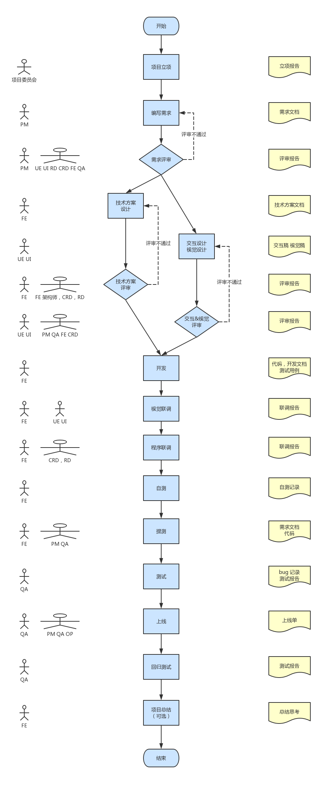

# 双越老师分享

**大厂的前端项目开发流程**

各位同学晚上好，欢迎大家关注这次分享。接下来我（双越老师）给大家分享一个话题 —— 大厂前端项目的研发流程。即，在一线互联网公司，一个项目的开发，或者产品的迭代，从一开始到上线，都要经历哪些核心步骤、哪些角色人员。而我们前端程序员，又是如何参与其中的。

这个主题是我在一年多之前就想做的，只是一直拖到近期才产出了这篇分享。我好多年之前结识了一个创业公司的技术负责人，一直也没断了联系，有一次和他约饭，他就说：现在公司慢慢壮大，几十个人了，想了解一下大厂的开发规范，否则越大越难管理。

当时我也没做什么准备，于是就边吃边聊，把我想到的都跟他说了，不过比较散乱。从那时候开始，我就想应该很多人都有这个困惑，特别是中小型公司的管理者和程序员。于是，经过了这么久我还是最终整理出了这篇分享稿。

但是，本次分享并不是泛泛而谈，我除了会讲解各个流程、阶段和角色人员之外，还会讲到一些我们常用的工具、技术点。我觉得我也有能力给大家讲出来，因为我既是一名大厂的高级前端工程师、有一定的开发经验，又是一名 PMP 和项目负责人、有项目管理的知识积累和实践。## 

闲话不多说，画了一个流程图给大家做一个整体流程、角色、交付物的概述。（图的内容较多，给大家 2 分钟的时间查看）

接下来给大家介绍一下各个角色。

🍎项目委员会：这是一个很虚的角色，即能确定项目是否要做的那帮人，有时候可能就是一个高级经理就能拍板确定。和我们实际开发没啥关系，不用去关心他。

🍎PM：产品经理，也是一个项目的推动者，即兼职项目经理的角色。

🍎UE：交互设计师，负责页面布局、交互的设计，不负责视图的细节。

🍎UI：视觉设计师，交互确定之后，设计页面样式。注意，很多情况下，UE 和 UI 是一个人。

🍎RD：后端开发人员。

🍎CRD：客户端开发人员，安卓和 ios 都是。

🍎FE：前端开发人员。

🍎QA：测试人员。

🍎OP：服务器运维人员，一般负责审批上线单。

🔔在说几点注意事项：（内容较多哈）

这个流程是站在前端开发角度来分析的，因此好多步骤的发起人都是 FE 。

PS：在此我也希望大家在工作中都要做到积极热情，主动承担一些事情，你会得到收获的。

这个流程看着非常复杂冗长，你可能会担心执行起来的效率。

其实，我只是把所有的细节都画出来了而已，实际执行起来不会太麻烦，有些事情很快就能做完，例如联调。

图右侧列出了每个步骤的交付物，即该步骤做完需要产出的文档或者其他内容。

交付物是项目管理中非常重要的概念，有了交付物才有能证明你真正做了执行并完成了这个步骤，而且万一后面出了问题，也可以回溯（甩锅）。

例如评审会结束之后，一定群发邮件写出会议结论和评审人。

上述流程有些可能会被大家忽略，或者觉得多余、浪费时间，例如技术方案设计和评审，再例如自测。

其实只要你有点开发经验或者项目管理经验，都应该知道这不是浪费时间。

拿技术方案设计来说，如果你接下来开发程序很顺利，写一个技术方案并不是难事儿，你不会因此而延期；

但如果你技术方案写了两天都没写出来，那你开发的时候估计也磕磕绊绊不顺利，延期风险很大。

🔔接下来是详细流程

接下来我们将假想一个实际的案例（因为我们不会在这里演示如何开发）

—— 为页面增加评论（发布评论，评论列表、点赞、回复）

 —— 这个功能，来把上述各个步骤详细分析一下，

一来是再深入了解一些细节，二来是帮助大家加深对整个研发流程的理解和印象。

## 项目立项

这个过程我们作为 FE 很可能是参与不到，或者压根就不知道的。

因为在需求评审之前，所有的事情都是 PM 来主导的，只有项目立项之后，并且 PM 把需求编写完成，才能流转到 FE 这里。

总之，这个过程你不用关心，只需要知道有了这个过程，PM 才能编写需求，并发起需求评审。

## 编写需求和需求评审

编写需求是 PM 的工作，我们不用关心。接下来 PM 会拉各个角色（UE UI RD CRD FE QA）开会，进行需求评审。会议的主要步骤：

第一，PM 会按照需求文档把功能全部讲一遍，包括 C 端的各个功能（如发布评论，评论列表、点赞、回复），也包括后台的一些策略（黄反、敏感词屏蔽）和统计；

第二，各个角色的与会者提出自己的问题，PM 来解答；

第三，如果问题全部被解答，则评审通过，否则评审不通过。

FE 参见需求评审和其他 RD CRD 类似，最重要的是关心这些功能的技术实现：是否可实现，或者实现成本高不高。

例如，PM 要在用户长按点赞按钮时显示绚丽的动画，这一点使用 h5 来成本太高，你就可以建议 PM 在 h5 端换成简单动画。

另外，开发人员也可以对 PM 的功能逻辑提出质疑，不一定非得是技术问题。

评审结束之后，PM 一般就会向各个开发人员要排期。

🔔注意，这时候不能立刻答应，最好的回复方式是：

🎈：我们回去讨论一下，明天下班之前（或者某个未来不太久的时间点，都行）给你答复。

这样，你可以和其他 FE 或者架构师来讨论技术方案，一起评估一个比较靠谱的排期。

PS：如果你的项目有拍死的 deadline ，那没招了，你就安排加班吧。

## 编写技术方案

这一步容易被大家忽略，人类好像是本能的眼高手低，感觉看似比较简单的事情就很乐观。

越是这种心态，越要谨慎行事，在这里我建议所有的公司或者团队，都把编写技术方案作为一个必要的步骤，即打开开发前必须编写技术方案，并完成评审。

技术方案到底写什么——技术方案就是写你计划如何实现需求中的功能。

拿这个评论项目来说，发布功能如何实现？
要调用什么接口，输入输出时什么？
要不要考虑 xss 攻击？
再如点赞，是先执行动画再调用接口，还是先调用接口再执行动画？
还有，你的代码如何拆解，分几个模块，有哪些核心的方法。这些都要写。

技术方案没有一个固定的格式可供参考，因此是否能把技术方案写的清晰且使用，是判断一个人技术能力的标准之一。

## 技术方案评审

 技术方案编写完成之后，需要拉内部的经理、架构师（或者技术负责人）、其他对接的角色（RD CRD）来评审技术方案。

 内部人员注意评审这个方案是不是符合设计原则，有扩展性，以及是否有其他坑（如性能问题，安全漏洞等）。

外部对接的角色主要评审接口是否全面，输入输出设计是否合理。

技术方案评审通过之后，就得给 PM 反馈排期了。

🔔注意，估算工期一定要留有 buffer ，给自己留好余地。

有工作经验的人都知道，一个人在一个公司里，一般会同时担任很多的工作，你不能保证接下来不会有其他功能耽误你的时间。

例如，这个项目你本来预估是 10 人/天工作量，那你最好反馈 12-13 人/天。

PS：评审之前反馈排期也可以，只是评审之后反馈，更加靠谱一些。

补充一句。这里我们仅仅提到了 FE 的技术方案评审，其实 CRD 和 RD 也会有他们的技术方案评审，评审时也需要拉着 FE 。

其实大家的关系都是相互的，彼此相互把关，出来的设计方案就不会有太大问题。

## 交互视觉设计和评审

交互和视觉的设计，是 UE 和 UI 要做的事情，我们不管他们怎么做。他们做完之后会拉着 PM FE CRD QA 进行设计稿的评审，即看看这个页面最终是什么样子。

FE 去参加主要看看视觉的实现是否有难度，特别是对一些透明、渐变、毛玻璃、阴影等特效，要慎重对待，还有比较常见的例如 1px 边框的问题。

🔔这些如果你遇到了，但是不确定是否可以实现，那最好回去查查再回复他们。

评审通过之后，UI 将产出设计稿给 FE 。按照惯例，UI 应该给 750 像素的图，即以 iphone 6 两倍屏为标准的图，并且设计稿中标出所有的颜色色值和间距、字体的大小。

他们有专门的工具来导出这些，例如用 sketch 就可以轻松导出。

🔔注意，此时如果你已经给了排期，但是设计稿比较复杂的话，必须及时和 PM 沟通修改排期，有问题早发现早处理。

有了前端的技术方案，有了客户端、后端的接口，有了视觉设计稿，这时候就可以进行开发了。

一般需要从 git 里新拉一个分支，使用 mock 数据（此时后端还没有接口）。

如有客户端的对接，还需要用到一些模拟 native 能力的插件，如果你们没有那就只能等到和客户端联调时再看了。

开发产出的不仅仅是代码，还应该有开发文档（也可以是比较丰富的注释）和测试用例。

我们作为技术人员，往往以为一个软件项目最关键的就是代码开发，而传统的项目管理流程说，代码开发只占软件生命周期的 1/6 。

根据本文相信你能体会到，代码开发真的只占软件项目的很少一部分。

所以，作为程序员你要想自己值钱、有不可替代性，就要从整个软件项目的阶段入手，而不仅仅是提高开发能力。

## 视觉联调

代码开发完成之后，所有界面都做完了，你要告诉 UI 进行视觉联调。

虽然你自己是按照 UI 给的设计稿做的，但是你不一定每一个细节都做的正确，需要 UI 确认。

另外，各个手机屏幕的响应式做的怎样，也需要 UI 拿不同手机测试。他如何测试你不用管，只需要配合他就行了，遇到问题你就改。

这一步的产出是“联调报告”，不要被这个词给吓着，以为要写一个正规的文档。

现实不是这样的，待 UI 联调完了之后，让他在项目群里 @ PM 回复一下说“视觉联调通过”，这样就行了，这就是联调报告，有这个记录即可。

包括图中所有的“报告”，最常见的形式就是邮件和群信息。但是，哪怕就是一封邮件或者群信息，短短的一句话，这个步骤也不能省略。否则谁知道视觉联调已经成功了？

## 程序联调

 FE 开发 h5 页，CRD 开发客户端，RD 开发后端接口，待大家都开发完成之后，也需要把代码放在一起联调一下。

 将 h5 和后端代码打包到同一个测试机上，既可以联调 h5 和后端接口。

 将客户端的访问地址指向这个测试机，就可以联调客户端和后端接口，也可以联调客户端和 h5 。

联调成功之后，最好再给 PM 看一眼，让他确定这就是做出来的效果。

## 自测

这一步我是自己加的，也是我自己的做事风格。

但这一步不是我自创的，在传统软件项目管流程里，就有“冒烟测试”这一步骤，也就是自测。

但是，我在所有带过的团队中，都没有发现规定必须自测且产出自测记录。

🔔但是，我还是坚持自己的观点，我负责的项目必须要有自测步骤，而且我呼吁大家也要坚持自测。

🔔自测并不是把所有功能全部详细测试，而是把核心功能都测试一遍，并记录测试结果，保证主流程是能跑通的。

我相信每个有工作经验的同学都遇到过这种情况，程序员代码写完就提测给 QA 了，QA 一运行立马报错，无法继续测试，打回来找程序员重新修改。

这种事情极大影响效率，谁都不乐意看到。如何避免呢？答案就是提测前，先自测。

自测依据需求的核心功能，可以是人肉手动测试，有可以是自动化单元测试，这个不要求。

但是最后要产出一个自测记录，即用一个表格，列出所有核心功能，并记录每个功能你的测试结果。

为何要有这个产出，就是为了证明你真的测试过每个功能了，而不是眼高手低看两眼就通过了。一般需要产出交付物时，大家都会认真对待，没有交付物大家就可能敷衍了事。

## 提测

自测完成，并产出自测记录，即可以提测了。

提测需要 FE CRD RD 和 PM 一起，将需求文档、代码、自测记录提交给 QA ，并发正式的提测邮件，告知所有项目角色该项目提测了。

QA 收到之后，确认分析完成，需要回复计划的测试完成时间。然后 QA 开始测试。

QA 测试过程中肯定会不断的产出 bug 列表，此时 FE 应该要求 QA 把所有 bug 的描述都写清楚，即能让个自己傻瓜式的复现这个 bug ，以便快速修改。

遇到复现不了的问题，一定要第一时间找 QA 来复现，有些问题复现了一次再也复现不了，那你就先别管它，先去改别的问题。

QA 测试完成之后，要发准出邮件，告诉所有项目角色该项目测试通过，可以准备上线了。

## 上线 & 回归测试

QA 测试完之后不一定能立马上线，因为一般产品的上线都是例行的。频率比较快的产品，可能规定每周一到周四下午的某个时间点可以上线，晚上一般不上线，周五一般不上线，除非紧急修复 bug 。

因为，上线之后就有可能带来一些 bug ，可能晚些才能发现，如果晚上或者周五上线，一旦发现 bug 大家已经回家睡觉或者过周末了，不容易集中人力修改。

上线的步骤一般是先合并代码到 dev 或者 master 分支，每次上线可能是多个功能一起上线，因此合并代码时还可能会出现冲突，得先解决冲突。

然后开始发起上线审批，生成上线单，需要 PM QA 和各个技术经理审批确认，OP 才能将这个上线单解锁，这样就可以发起上线。

上线的机器一般也分好几步，每一步都需要 QA 参与回归测试。

🎈第一步是预览机，预览机只对内有效，外网看不到，但是加载线上的真实数据。

🎈第二步是单台机器，即线上机的一台机器。

🎈第三步是单机房，即线上机的一个机房。

🎈第四步是全量，即线上机的所有机房。

这些步骤全部操作完成，并且 QA 全部回归测试完成，才算真正的结束。

如果其中一个步骤遇到问题，就需要启动快速回滚。

回滚就是用 git 的上一条记录重新上线，覆盖目前的代码，步骤也是先预览机、单机器、单机房、全量，每一步也需要 QA 回归测试。

如果 bug 影响严重，还需要项目的主要角色写检讨，做复盘汇报，总结教训。

项目总结是可选的，而且我发现大部分的团队都不会去做总结，觉得上线完了就大功告成，该启动下一个项目了。

但我觉得，无论是不是做项目，做完一件事（如看完一本书）就应该自己总结一下。

回顾一下经过，总结一下得失，积累一点经验，这样才能慢慢成长。

经过这么多步骤的详细描述，相信大家对整个流程都有了一个全秒的了解，包括所有的角色、步骤、交付物。

 <RightMenu />