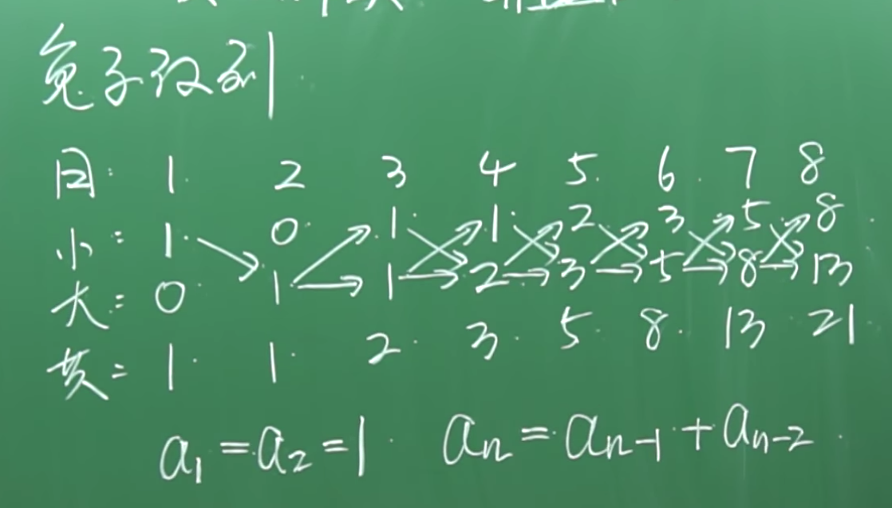

## 兔子数列

在1202年，斐波那契写一本书，叫《算盘书》，书中提出了 `兔子数列`



```js
'use strict'
function fibonacci (n, n1, n2) {
  if (n <= 1) {
    return n2
  }
  return fibonacci(n - 1, n2, n1 + n2)
}

console.log(fibonacci(10, 1, 1))
```

